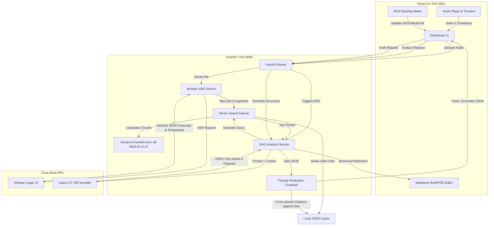

# 🎙️ Echo: Voice-to-Roadmap AI Copilot

**Echo** is an AI-powered Product Management assistant that bridges the gap between qualitative user research and quantitative product roadmap prioritization. It transcribes audio recordings (via Whisper ASR), extracts core pain points and challenges, prioritizes recommendations via the RICE/MoSCoW frameworks, and drafts comprehensive PRDs or Strategic Executive Briefs—all grounded in 100% verifiable, timestamped source citations.

---

## 🏗️ Technical Architecture Flowchart

Below is the technical data flow of Echo, showing how raw audio is transformed into a verified, prioritized roadmap and drafted documents:



---

## ✨ Key Features

1. **🎙️ Context-Aware Audio Transcription**
   * Powered by Groq-accelerated Whisper-Large-v3.
   * Auto-detects the nature of the conversation (`SaaS Usability Feedback` vs. `General Qualitative/Topic Research`).
   * Adapts all vocabulary and metrics dynamically based on the classification.

2. **🔍 Zero-Hallucination RAG Citations**
   * Computes semantic vector embeddings locally using `all-MiniLM-L6-v2`.
   * Programmatically validates all AI assertions against raw transcript databases before rendering, enforcing absolute factuality.
   * Clicking a citation bubble seeks the audio player to the exact second in the recording.

3. **📊 Interactive Prioritization Backlog**
   * Calculates dynamic **RICE scores** (Reach × Impact × Confidence / Effort) for software roadmaps.
   * Calculates **Priority scores** (Importance × Impact × Evidence / Difficulty) for research action plans.
   * Fully interactive spreadsheet allows the PM to modify values directly in the cells with live score updates.

4. **📄 Automated Document Drafting**
   * Generates a fully populated **Product Requirement Document (PRD)** for software projects.
   * Generates an **Executive Strategy Brief / Memo** for research studies.
   * Automatically references exact user quotes in the requirements and problem statements.

---

## 🛠️ Technology Stack

* **Frontend**: React (Vite), Vanilla CSS Variables (Light Theme, soft shadow glassmorphism panels), Lucide React Icons.
* **Backend**: FastAPI, Python 3.13, Pydantic, Numpy.
* **Embeddings**: SentenceTransformers (`all-MiniLM-L6-v2` running locally).
* **APIs**: Groq SDK (Whisper-Large-v3 for ASR, Llama-3.3-70B-Versatile for NLP).

---

## 🚀 How to Run Locally

### Prerequisites
* Python 3.8+ installed.
* Node.js and npm installed.
* A valid **Groq API Key** (get one for free at [console.groq.com](https://console.groq.com/)).

### Step 1: Environment Configuration
Create a `.env` file in the root directory:
```bash
GROQ_API_KEY=your_groq_api_key_here
```

### Step 2: Set Up Virtual Environment & Backend
```bash
# Create virtual environment
python3 -m venv .venv
source .venv/bin/activate

# Install dependencies
pip install -r backend/requirements.txt
```

### Step 3: Install Frontend Dependencies
```bash
cd frontend
npm install
cd ..
```

### Step 4: Run the Servers
We provide a simple startup script `run.sh` which launches the FastAPI server (port `8000`) and the Vite development server (port `3001`) concurrently:
```bash
chmod +x run.sh
./run.sh
```

Open your browser and navigate to **`http://localhost:3001`**.
