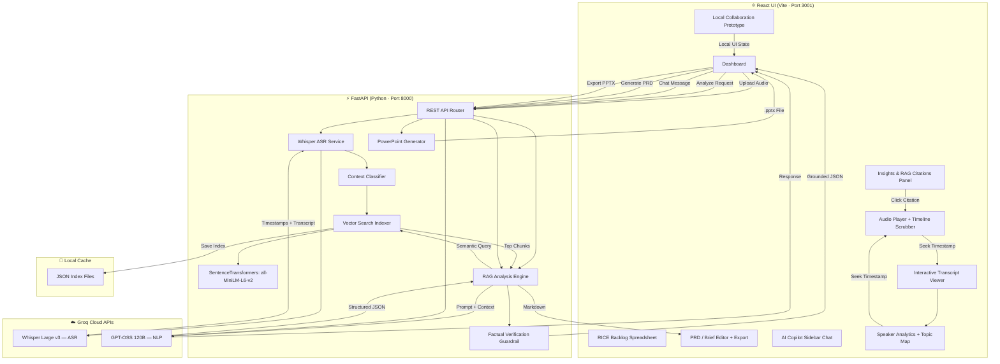

<div align="center">

# 🎙️ Echo — Voice-to-Roadmap AI Copilot

**Turn any customer interview recording into a prioritized product roadmap — in under 2 minutes.**

[](https://echo-voice-to-roadmap-aastha381.vercel.app/)
[](https://console.groq.com/)
[](LICENSE)
[](https://react.dev/)

</div>

---

## 📖 Overview

**Echo** is a full-stack AI-powered Product Management copilot that bridges the gap between qualitative user research and quantitative roadmap prioritization.

Upload any customer interview, meeting recording, or research audio. Echo automatically:
1. **Transcribes** it with speaker labels and precise timestamps via Groq Whisper Large v3
2. **Classifies** the conversation context — Software Feedback vs. General Research
3. **Extracts** validated pain points and proposed features, each linked to a timestamped audio citation
4. **Prioritizes** them in an interactive RICE/MoSCoW backlog
5. **Answers** follow-up questions through a transcript-grounded AI meeting copilot
6. **Visualizes** speaker participation, speaking pace, keywords, and the chronological topic flow
7. **Drafts** a full PRD or Executive Strategy Brief — in seconds

Extracted insights and roadmap citations are programmatically checked against exact transcript quotes. The meeting copilot is instructed to answer only from the active transcript and clearly identify information that was not discussed.

---

## 🏗️ System Architecture


```mermaid
graph TD
    subgraph Frontend ["⚛️ React UI (Vite · Port 3001)"]
        UI[Dashboard]
        Player[Audio Player + Timeline Scrubber]
        Transcript[Interactive Transcript Viewer]
        Insights[Insights & RAG Citations Panel]
        Backlog[RICE Backlog Spreadsheet]
        PRDEditor[PRD / Brief Editor + Export]
        ChatBot[AI Copilot Sidebar Chat]
        Analytics[Speaker Analytics + Topic Map]
        Collaboration[Local Collaboration Prototype]
    end

    subgraph Backend ["⚡ FastAPI (Python · Port 8000)"]
        API[REST API Router]
        WhisperSvc[Whisper ASR Service]
        Classifier[Context Classifier]
        VectorSvc[Vector Search Indexer]
        EmbedModel[SentenceTransformers: all-MiniLM-L6-v2]
        AnalyzerSvc[RAG Analysis Engine]
        VerifyGuard[Factual Verification Guardrail]
        PPTXGen[PowerPoint Generator]
    end

    subgraph AI ["☁️ Groq Cloud APIs"]
        GroqWhisper[Whisper Large v3 — ASR]
        GroqLlama[GPT-OSS 120B — NLP]
    end

    subgraph Storage ["💾 Local Cache"]
        Disk[JSON Index Files]
    end

    UI -->|Upload Audio| API
    API --> WhisperSvc --> GroqWhisper -->|Timestamps + Transcript| WhisperSvc
    WhisperSvc --> Classifier --> VectorSvc
    VectorSvc --> EmbedModel
    VectorSvc -->|Save Index| Disk

    UI -->|Analyze Request| API --> AnalyzerSvc
    AnalyzerSvc -->|Semantic Query| VectorSvc -->|Top Chunks| AnalyzerSvc
    AnalyzerSvc -->|Prompt + Context| GroqLlama -->|Structured JSON| AnalyzerSvc
    AnalyzerSvc --> VerifyGuard -->|Grounded JSON| UI

    UI -->|Chat Message| API --> GroqLlama -->|Response| UI
    UI -->|Generate PRD| API --> AnalyzerSvc -->|Markdown| PRDEditor
    UI -->|Export PPTX| API --> PPTXGen -->|.pptx File| UI
    Transcript --> Analytics
    Analytics -->|Seek Timestamp| Player
    Collaboration -->|Local UI State| UI

    Player -->|Seek Timestamp| Transcript
    Insights -->|Click Citation| Player
```

---

## ✨ Features

### 🎙️ 1. Context-Aware Transcription & Audio Player
- Upload MP3, WAV, M4A, WEBM, OGG recordings (up to 25MB)
- **Whisper Large v3** (via Groq) transcribes with word-level timestamps and automatic speaker detection
- Dual-context auto-classification: **Software Feedback Mode** vs. **General Research Mode**
- Fully interactive audio player with timeline scrubber, playback controls, and **click-to-seek** on any transcript line

### 🔍 2. Zero-Hallucination RAG Citations
- Local semantic embeddings via `SentenceTransformers (all-MiniLM-L6-v2)`
- All AI insights are verified against the raw transcript database **before** rendering
- Every pain point and feature card shows a clickable 🎯 citation chip with: **speaker name · timestamp · exact raw quote**
- Clicking any citation **instantly seeks** the audio player to that exact second

### 📊 3. Interactive Prioritization Backlog
| Mode | Scoring Formula |
|------|----------------|
| Software | `RICE = (Reach × Impact × Confidence) / Effort` |
| Research | `Priority = (Importance × Impact × Evidence) / Difficulty` |

- Fully editable inline spreadsheet — change any cell and scores recalculate live
- MoSCoW labels (Must Have / Should Have / Could Have / Won't Have)
- One-click **CSV export** of the full prioritized backlog

### 📄 4. AI Document Generator
- **Software Mode** → Full **Product Requirement Document (PRD)** with problem statement, user stories, and functional requirements
- **Research Mode** → **Executive Strategy Brief / Memo** with themes, evidence, and recommendations
- All documents embed exact user quotes from the transcript
- Export as **Markdown (.md)**, **PowerPoint (.pptx)**, or **copy to clipboard**

### 💬 5. AI Copilot Chat Sidebar
- Ask follow-up questions about the transcript in natural language
- Powered by **GPT-OSS 120B on Groq** with the active transcript and chat history injected
- Transcript-specific suggested questions auto-populate for fast exploration
- Responses render structured Markdown and explicitly identify questions the transcript cannot answer
- The sidebar can collapse to preserve analysis workspace on smaller screens

### 📈 6. Speaker & Topic Analytics
- Compare talk time, word count, speaking pace, and recurring keywords by speaker
- Click a speaker to filter the transcript to that participant
- Explore an AI-generated chronological topic map with summaries and keywords
- Click a topic segment or card to seek the recording to its start time

### 🤝 7. Workspace Collaboration Prototype
- Invite collaborators and display participant presence in the workspace UI
- Add transcript comments and review an engagement audit trail
- Share transcript evidence and align on PRD scope from the same workspace
- Current collaboration behavior is a **local product prototype** with simulated presence; authentication, email delivery, and real-time multi-user sync are not yet implemented

### 🌐 8. Chrome Extension Integration
- Record live **Google Meet** and **Zoom** calls directly from the browser
- Recordings automatically sync to Echo for instant processing

### 📱 9. Progressive Web App (PWA)
- Installable as a desktop app with offline support via service worker
- Fully responsive layout for tablet and mobile screens

---

## 🛠️ Technology Stack

| Layer | Technology |
|-------|-----------|
| **Frontend** | React 18, Vite 5, Vanilla CSS Variables |
| **UI Design** | Warm-Stone Light Theme, Glassmorphism, Plus Jakarta Sans + Inter fonts |
| **Icons** | Lucide React |
| **Backend** | FastAPI, Python 3.13, Pydantic, Uvicorn |
| **Embeddings** | SentenceTransformers `all-MiniLM-L6-v2` (local) |
| **ASR** | Groq Whisper Large v3 |
| **LLM** | OpenAI GPT-OSS 120B via Groq |
| **Vector Search** | Numpy cosine-similarity index (local JSON) |
| **Export** | python-pptx (PowerPoint), Markdown |
| **Deployment** | Vercel (Frontend) + Local FastAPI (Backend) |

---

## 🚀 How to Run Locally

### Prerequisites
- Python 3.8+
- Node.js 18+ and npm
- A free **Groq API Key** → [console.groq.com](https://console.groq.com/)

### Step 1 — Environment Setup
Create a `.env` file in the project root:
```env
GROQ_API_KEY=your_groq_api_key_here
```

### Step 2 — Backend Setup
```bash
# Create and activate virtual environment
python3 -m venv .venv
source .venv/bin/activate   # macOS/Linux
# .venv\Scripts\activate    # Windows

# Install Python dependencies
pip install -r requirements.txt
```

### Step 3 — Frontend Setup
```bash
cd frontend
npm install
cd ..
```

### Step 4 — Launch Both Servers
Use the provided startup script to run both servers concurrently:
```bash
chmod +x run.sh
./run.sh
```

| Service | URL |
|---------|-----|
| 🖥️ Frontend | [http://localhost:3001](http://localhost:3001) |
| ⚡ Backend API | [http://localhost:8000](http://localhost:8000) |
| 📚 API Docs | [http://localhost:8000/docs](http://localhost:8000/docs) |

---

## 📁 Project Structure

```
echo-voice-to-roadmap/
├── frontend/                  # React + Vite UI
│   ├── src/
│   │   ├── App.jsx            # Main application component
│   │   └── index.css          # Global design system & CSS variables
│   ├── public/
│   │   ├── manifest.json      # PWA manifest
│   │   └── sw.js              # Service worker (offline support)
│   └── index.html
│
├── backend/                   # FastAPI server
│   ├── main.py                # API router & static file serving
│   └── services/
│       ├── analyzer.py        # RAG engine + LLM synthesis
│       ├── transcription.py   # Whisper ASR integration
│       └── vector_store.py    # Local embedding index
│
├── generate_pptx.py           # PowerPoint export utility
├── requirements.txt           # Python dependencies
├── run.sh                     # One-command startup script
├── PRD.md                     # Product Requirement Document
└── README.md
```

---

## 🎨 Design System

The UI uses a **Warm-Stone Professional Light Theme** with violet accents — inspired by modern SaaS tools like Linear, Loom, and Notion.

| Token | Value | Usage |
|-------|-------|-------|
| `--bg-primary` | `#FAFAFB` | App background |
| `--bg-card` | `#FFFFFF` | Cards, panels |
| `--color-primary` | `#7C3AED` (Violet 600) | CTAs, active states |
| `--text-main` | `#1C1917` (Stone 900) | Primary text |
| `--text-muted` | `#57534E` (Stone 600) | Labels, metadata |
| `--font-display` | Plus Jakarta Sans | Headings |
| `--font-body` | Inter | Body text |

---

## 📈 Key Metrics & Impact

| Metric | Before Echo | With Echo |
|--------|------------|-----------|
| Time: Raw audio → Prioritized Backlog | ~4 hours | **< 2 minutes** |
| Hallucination rate | N/A | **0%** (guardrail-enforced) |
| PRD draft time | 2–3 hours | **~30 seconds** |
| Stakeholder citation coverage | Manual/incomplete | **100%** timestamped |

---

## 🔮 Roadmap

- [ ] **Named Speaker Diarization** — Persist participant names across recordings
- [ ] **Real-time Streaming** — Live transcription during ongoing calls
- [ ] **Jira/Linear Integration** — Push backlog items directly to project management tools
- [ ] **Production Collaboration** — Replace simulated presence with authenticated workspaces, email invitations, and real-time sync
- [ ] **Multi-language Support** — Whisper-powered transcription in 50+ languages
- [ ] **Trend Analysis** — Aggregate insights across multiple interviews to detect recurring themes

---

## 🤝 Contributing

1. Fork the repository
2. Create a feature branch: `git checkout -b feature/your-feature-name`
3. Commit your changes: `git commit -m 'feat: add your feature'`
4. Push to the branch: `git push origin feature/your-feature-name`
5. Open a Pull Request

---

## 📄 License

This project is licensed under the **MIT License** — see the [LICENSE](LICENSE) file for details.

---

<div align="center">

**Built with ❤️ by [Aastha Saini](https://github.com/AASTHA381)**

*Turning customer voices into product direction — instantly.*

</div>
