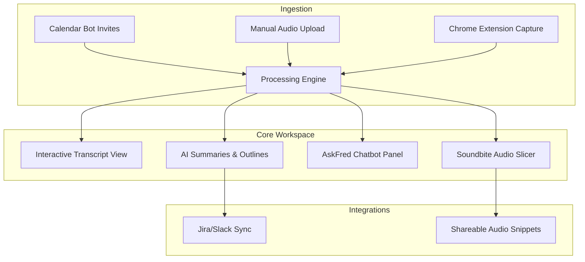
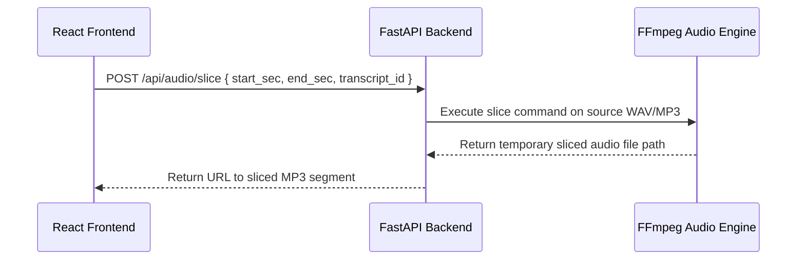

# Competitive Analysis: Fireflies.ai & Architecture Blueprint for Echo

This document provides a detailed breakdown of **Fireflies.ai**, its workflows, and actionable feature recommendations and architectural blueprints for the **Echo** Meeting Intelligence platform.

---

## Executive Summary
**Fireflies.ai** is a leading enterprise-grade AI voice assistant that automatically records, transcribes, and analyzes virtual meetings. Its primary value proposition lies in **frictionless automation** (no-click recording via calendar bots) and **deep workflow integrations** (syncing meeting briefs directly into Salesforce, Slack, HubSpot, and Linear).

By contrast, **Echo** is a localized, PM-focused Meeting Intelligence platform that specializes in transforming raw interview audio into grounded Product Requirement Documents (PRDs) and prioritized backlogs using semantic RAG citations.

---

## 1. Core Feature Tear-Down

| Feature Category | Fireflies.ai Capability | Echo Current State | Actionable Echo Opportunity |
| :--- | :--- | :--- | :--- |
| **Ingestion** | Live Zoom/Teams meeting bot; Direct audio upload; Chrome extension. | Direct audio upload; Chrome extension. | **Autopilot Calendar Bot**: Fetch calendars via Google Calendar API; trigger a headless Chrome instance to join calls. |
| **Diarization & ASR** | Multi-lingual diarized speech-to-text; custom vocabulary dictionary. | Local or cloud Whisper transcription; speaker segmenting. | **Custom Vocabulary Mapping**: Allow users to define project terms (e.g. specialized library names) to prevent Whisper misspelling. |
| **AI Assistant** | "AskFred" chatbot; pre-set templates (Sales, PM, Scrum). | Meeting Copilot; custom RAG chat. | **Prompt Templates**: Predefined system prompts for creating technical specs, user personas, or QA test cases. |
| **Collaboration** | Soundbites (audio snippet sharing); thread comments. | Workspace sharing; access logs. | **Interactive Soundbites**: Let users highlight transcript text and export it as an MP3 snippet. |
| **Integrations** | 40+ integrations (Salesforce, Slack, Zapier, Linear). | Local MD and CSV downloads. | **Webhook Integrations**: Push prioritized features directly into Jira or Linear backlogs. |

---

## 2. User Experience & Workflows



### A. Frictionless Ingestion Workflow
The user hooks their Google/Outlook calendar. The platform scans for meeting links (Zoom, Google Meet, Microsoft Teams, Webex). At the scheduled time, the **Fred Bot** joins the call as a participant, records, and uploads the audio.

### B. The 3-Column Post-Processing Workspace
Once transcribed, the user enters a unified workspace consisting of:
1. **Left Panel (Navigation & Smart Search)**: Outlines, topics, keywords, and action items.
2. **Center Panel (Interactive Player & Transcript)**: Clicking words seeks the audio; users can highlight text to add comments or create "Soundbites".
3. **Right Panel (AskFred Bot)**: Conversational chat interface to query the transcript or draft follow-up emails.

---

## 3. Actionable Architecture Blueprints for Echo

### Blueprint A: Interactive "Soundbites" (Audio Clip Sharing)
Enable Echo users to highlight a segment of the transcript and export/share that specific audio clip.



#### Technical Implementation:
1. **Frontend Selection**: Capture range selection on the transcript segments:
   ```javascript
   const createSoundbite = async (start, end, transcriptId) => {
     const res = await fetch(`/api/audio/slice`, {
       method: "POST",
       headers: { "Content-Type": "application/json" },
       body: JSON.stringify({ start_sec: start, end_sec: end, id: transcriptId })
     });
     const data = await res.json();
     return data.clip_url; // Load into a audio player modal
   };
   ```
2. **Backend FFmpeg Slicing**: Use `ffmpeg` to quickly extract the segment without re-encoding (extremely fast):
   ```python
   import subprocess

   def slice_audio(source_path: str, output_path: str, start: float, duration: float):
       cmd = [
           "ffmpeg", "-y", "-ss", str(start), "-t", str(duration),
           "-i", source_path, "-acodec", "copy", output_path
       ]
       subprocess.run(cmd, check=True)
   ```

---

### Blueprint B: Multi-Model Prompt Templates
Allow PMs to quickly switch context prompts in the Meeting Copilot.

```
+-----------------------------------------------------------+
| 🤖 AI Meeting Copilot                                     |
+-----------------------------------------------------------+
| Template: [ Agile Scrum Standup | v ]                     |
|                                                           |
| Current Prompt:                                           |
| "Analyze this standup transcript. Extract:                |
|  - What was completed yesterday                           |
|  - Tasks planned for today                                |
|  - Active blockers & impediments."                       |
|                                                           |
| [ Ask Copilot to Summarize ]                              |
+-----------------------------------------------------------+
```

#### Technical Implementation:
1. Define a template dictionary in `backend/services/analyzer.py`:
   ```python
   PROMPT_TEMPLATES = {
       "prd": "Focus on product requirements, edge cases, and design constraints...",
       "scrum": "Focus on blockers, completed items, and daily commitments...",
       "ux_research": "Focus on user pain points, emotional cues, and direct suggestions..."
   }
   ```
2. Add a `template` parameter to the `/api/chat` and `/api/analyze` FastAPI routes to load the corresponding system prompt dynamically.

---

### Blueprint C: Autopilot Calendar Ingestion (Bot Integration)
Establish a headless runner that joins Zoom or Google Meet calls to record audio automatically.

1. **Scheduling**: User connects Google Calendar. Cron job checks for upcoming meetings with meeting URLs.
2. **Launch Puppeteer/Playwright**: Launch a headless browser instance:
   ```javascript
   const browser = await playwright.chromium.launch({
     args: ['--use-fake-ui-for-media-stream', '--use-fake-device-for-media-stream']
   });
   const page = await browser.newPage();
   await page.goto(meetingUrl);
   ```
3. **Capture Stream**: Hook browser tab audio output to a media recorder writing to the FastAPI upload directory.
