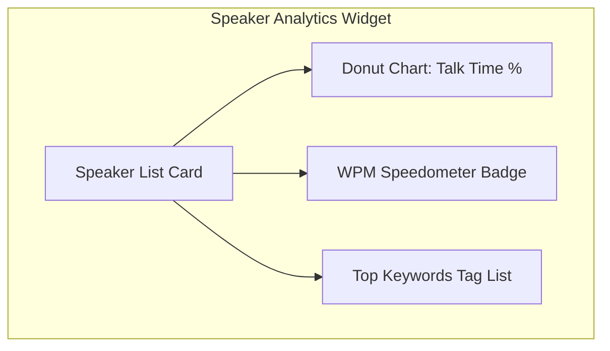
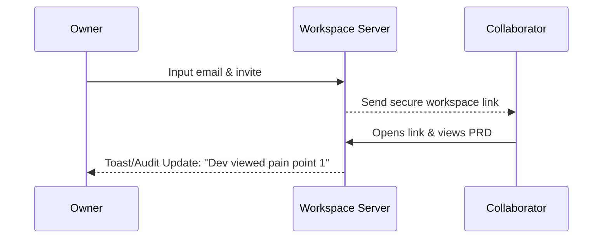

# Product & Design Specification: Collaboration & Meeting Intelligence Expansion

This document provides a comprehensive Product Requirement Document (PRD) and UI/UX Design Specification for expanding the **Echo Meeting Intelligence Platform** with four key strategic features:
1. **Speaker Analytics & Visualization**
2. **Collaboration & Engagement**
3. **Advanced Filtering**
4. **Topic Tracker**

---

## 1. Speaker Analytics & Visualization

### Feature Overview & User Value
Meetings often suffer from unequal participation, low engagement, or conversational monopolization. **Speaker Analytics** quantifies the conversational dynamic. By calculating individual talk-time, speaking pace (Words Per Minute), and tracking specific keywords per participant, product managers and user researchers can identify bias, monitor participant fatigue, and ensure balanced qualitative data collection.

### User Stories & Acceptance Criteria
* **User Story**: As a Researcher, I want to see a percentage breakdown of talk time for each speaker so that I can evaluate if the interview was balanced or dominated by one party.
* **Acceptance Criteria**:
  * The system must display a color-coded circular ring or stacked progress bar representing the total talk time per speaker.
  * Clicking on a speaker's analytic card must filter the transcript to only show that speaker's dialogue.
  * The system must calculate and display the average speaking rate in Words Per Minute (WPM) for each participant.
  * Visual markers must highlight when a speaker exceeds normal speaking pace thresholds (e.g., >160 WPM representing rushed speech).

### Proposed UX/UI Layout & Visualization Concepts


#### UI Mockup Layout (Right-hand Panel or Summary Tab)
```
+-----------------------------------------------------------+
| 📊 Speaker Participation Insights                          |
+-----------------------------------------------------------+
| [ Donut Chart: 65% Speaker 1 | 35% Speaker 2 ]            |
|                                                           |
| 👤 Speaker 1 (User Researcher)                             |
|    |████████████████████████████| 65% (12:45 min)           |
|    Pace: 125 WPM (Moderate) • Top words: [patents, FSF, copy] |
|                                                           |
| 👤 Speaker 2 (Interviewee)                                 |
|    |██████████████| 35% (06:12 min)                        |
|    Pace: 155 WPM (Fast)     • Top words: [danger, cost, legal] |
+-----------------------------------------------------------+
```

### Technical Considerations & Data Requirements
* **ASR Diarization**: The transcription engine (e.g., Deepgram or Whisper with PyAnnote integration) must return diarized segments containing a `speaker` label, `start` offset, `end` offset, and `words` array with individual word timestamps.
* **WPM Formula**:
  $$\text{WPM} = \frac{\text{Total Words Spoken}}{\text{Total Talk Duration (seconds)} / 60}$$
* **API Payload Schema**:
  ```json
  {
    "speaker_analytics": {
      "speaker_1": {
        "talk_time_secs": 765.0,
        "percentage": 65.2,
        "words_count": 1593,
        "avg_wpm": 125,
        "frequent_keywords": ["patents", "copyleft", "license"]
      }
    }
  }
  ```

---

## 2. Collaboration & Engagement

### Feature Overview & User Value
Product discovery is a team sport. **Collaboration & Engagement** bridges the gap between individual research and cross-functional teams by letting product managers invite engineers and stakeholders directly into a transcript workspace, and audit engagement (who read the PRD, who listened to the audio, and who reviewed specific pain points). This drives shared context and alignment.

### User Stories & Acceptance Criteria
* **User Story**: As a PM, I want to share a grounded transcript view with a developer and track if they have reviewed the citations so that I know they have context before we start grooming.
* **Acceptance Criteria**:
  * Users can generate a secure, temporary workspace access token or email invite link.
  * A view-log (audit trail) must record when invited team members open the transcript, view specific pain points, or export a draft PRD.
  * Collaborative workspace comments can be attached directly to timestamps or transcript segments.

### Proposed UX/UI Layout & Visualization Concepts


#### Shared Context Dashboard Mockup
```
+-----------------------------------------------------------+
| 👥 Workspace Engagement Audit                              |
+-----------------------------------------------------------+
| Invite Collaborator: [ Email Address... ] [ Send Invite ]  |
|                                                           |
| Activity Feed:                                            |
| • 🟢 Sarah (Eng Lead) viewed "Pain Point 2" (Software Patents) |
|   2 mins ago • JUMP TO SECTION                            |
| • 🔵 Alex (UX) left a comment on segment 12 [05:14]:      |
|   "This matches our user testing findings!"               |
+-----------------------------------------------------------+
```

### Technical Considerations & Data Requirements
* **Access Control**: Implementation of Role-Based Access Control (RBAC) with `Owner`, `Editor` (can rename, delete, add citations), and `Viewer` (can listen, read, and comment).
* **Audit Database Schema (MongoDB/PostgreSQL)**:
  | Field | Type | Description |
  | :--- | :--- | :--- |
  | `workspace_id` | UUID | Associated transcript/brief registry ID |
  | `user_id` | String | Email or login hash of the collaborator |
  | `action` | Enum | `view_segment`, `read_prd`, `play_audio`, `add_comment` |
  | `target_id` | String | Reference to the segment_id or feature_id viewed |
  | `timestamp` | DateTime | Timestamp of the event |

---

## 3. Advanced Filtering

### Feature Overview & User Value
Sifting through hours of meetings is tedious. **Advanced Filtering** lets product managers quickly query transcripts and RAG backlogs using multi-attribute conditions, isolating critical moments (e.g. "show only parts where questions were asked about pricing" or "show segments containing task keywords from yesterday").

### User Stories & Acceptance Criteria
* **User Story**: As a Researcher, I want to filter the transcript to only show parts containing questions asked by the interviewer, so that I can analyze how the interviewee responded to specific prompts.
* **Acceptance Criteria**:
  * Users can filter transcripts by Speaker, Keyword/Semantic match, Time ranges (e.g., between minute 5 and 10), and Sentence structure (e.g., questions vs statements).
  * System must support toggling filters dynamically without refreshing the page.
  * Dynamic counts must update to show how many segments match the active filter.

### Proposed UX/UI Layout & Visualization Concepts
```
+-----------------------------------------------------------------------+
| 🔍 Filter Transcript                                                   |
+-----------------------------------------------------------------------+
| [ Speaker: [Speaker 2] x ] [ Type: [Questions] x ] [ Range: [05s-12s] ] |
| Matches: 14 segments found                                            |
|                                                                       |
| [05:14] 👤 Speaker 2: "What is the cost of filing a software patent?"|
| [08:30] 👤 Speaker 2: "How do you protect your code from copying?"    |
+-----------------------------------------------------------------------+
```

### Technical Considerations & Data Requirements
* **Semantic Parsing**: To isolate questions, a simple regex parser `/\?$/` can be run against segment text, or a NLP tagging pipeline (like spaCy or HuggingFace transformers) can label the grammatical mood of each sentence (interrogative, declarative, imperative).
* **Index Query Optimization**:
  ```sql
  SELECT * FROM segments 
  WHERE transcript_id = :tid 
    AND speaker = :speaker
    AND text LIKE '%?%'
    AND start_time BETWEEN :start AND :end
  ORDER BY start_time ASC;
  ```

---

## 4. Topic Tracker

### Feature Overview & User Value
Conversations wander naturally. **Topic Tracker** provides a chronological timeline map showing exactly when specific themes were introduced, how long they were discussed, and how the discussion transitioned from one topic to the next. This acts as a table of contents for the meeting.

### User Stories & Acceptance Criteria
* **User Story**: As a Product Owner, I want an interactive timeline map of topics discussed so that I can click on a topic block and jump straight to that part of the audio playback.
* **Acceptance Criteria**:
  * The system must automatically detect, cluster, and label conversation topics.
  * The timeline must render as a horizontal track, color-coded by topic category.
  * Clicking a topic block on the timeline must seek the audio player to the start of that topic discussion block.

### Proposed UX/UI Layout & Visualization Concepts


```mermaid
gantt
    title Chronological Topic Map
    dateFormat  X
    axisFormat %m:%s
    section Introduction
    Intro & Welcome            :active, 0, 120
    section Technical
    Software Patents           :crit, 120, 480
    Copyright & Copyleft       :active, 480, 720
    section Summary
    Action Items & wrap-up     : 720, 900
```

#### Interactive Topic Panel UI
```
+-----------------------------------------------------------+
| 🗺️ Conversation Map & Topic Timeline                       |
+-----------------------------------------------------------+
| [=== Intro ===][======== Patents =======][=== Copyleft ===] |
| 00:00 - 02:00    02:00 - 08:00            08:00 - 12:00   |
|                                                           |
| Detected Themes:                                          |
| 🔴 Software Patents (6 mins duration)                     |
|    - Keywords: monopoly, technique, legal, cost           |
|    - Grounded in 12 segments • JUMP TO TOPIC START        |
+-----------------------------------------------------------+
```

### Technical Considerations & Data Requirements
* **Topic Modeling Pipeline**:
  1. Chunk the transcript into rolling windows of 5 segments.
  2. Generate semantic embeddings (using a model like OpenAI `text-embedding-3-small` or HuggingFace `all-MiniLM-L6-v2`).
  3. Apply clustering (like HDBSCAN or KMeans) to group similar segments.
  4. Use an LLM (like GPT-4o-mini or Gemini-1.5-flash) to generate a concise title label for each cluster based on the combined text chunks.
* **API Payload Schema**:
  ```json
  {
    "topics": [
      {
        "id": "topic_1",
        "label": "Critique of Software Patents",
        "start_sec": 120.0,
        "end_sec": 480.0,
        "keywords": ["patent", "monopoly", "technique", "court"],
        "summary": "The discussion focuses on how software patents create monopolies."
      }
    ]
  }
  ```
